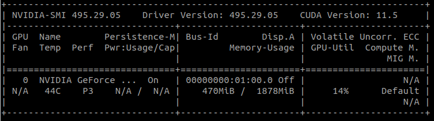

# OpenCV

Build OpenCV 4.5.2 with cuda support

- ubuntu 20.04
- Nvidia MX450 (nvidia-driver-470)


## Check 
```
nvidia-smi
```


## Install cuda
[CUDA Toolkit 11.5 Update 1 Downloads](https://developer.nvidia.com/cuda-downloads?target_os=Linux&target_arch=x86_64&Distribution=Ubuntu&target_version=20.04)


## Install OpenCV
[How to install OpenCV 4.5.2 with CUDA 11.2 and CUDNN 8.2 in Ubuntu 20.04](https://gist.github.com/raulqf/f42c718a658cddc16f9df07ecc627be7)

```
cmake -D CMAKE_BUILD_TYPE=RELEASE \
-D CMAKE_INSTALL_PREFIX=/usr/local \
-D WITH_TBB=ON \
-D ENABLE_FAST_MATH=1 \
-D CUDA_FAST_MATH=1 \
-D WITH_CUBLAS=1 \
-D WITH_CUDA=ON \
-D BUILD_opencv_cudacodec=OFF \
-D WITH_CUDNN=OFF \
-D OPENCV_DNN_CUDA=OFF \
-D WITH_V4L=ON \
-D WITH_QT=OFF \
-D WITH_OPENGL=ON \
-D WITH_GSTREAMER=ON \
-D OPENCV_GENERATE_PKGCONFIG=ON \
-D OPENCV_PC_FILE_NAME=opencv.pc \
-D OPENCV_ENABLE_NONFREE=ON \
-D OPENCV_EXTRA_MODULES_PATH=~/Downloads/opencv_contrib-4.5.2/modules \
-D INSTALL_PYTHON_EXAMPLES=OFF \
-D INSTALL_C_EXAMPLES=OFF \
-D BUILD_EXAMPLES=OFF ..
```

!!! Note
    If opencv not find CUDA set `` variable
    ```
    export CUDA_PATH=/usr/local/cuda-11.5
    ```

### TODO: cuDNN
```
CUDNN_INCLUDE_DIR:PATH=/home/user/Downloads/cudnn/include
-D CUDNN_INCLUDE_DIR=/usr/include/cudnn.h
CUDNN_LIBRARY:FILEPATH=/home/user/Downloads/cudnn/lib64/libcudnn.so
-D CUDNN_LIBRARY-/usr/lib/x86_64-linux-gnu/libcudnn.so
```

### Check
```python
import cv2
cv2.__version__
# '4.5.2'
cv2.cuda.getCudaEnabledDeviceCount()
# 1
print(cv2.getBuildInformation())
#   NVIDIA CUDA:                   YES (ver 11.5, CUFFT CUBLAS FAST_MATH)
#     NVIDIA GPU arch:             35 37 50 52 60 61 70 75 80 86
#     NVIDIA PTX archs:
```